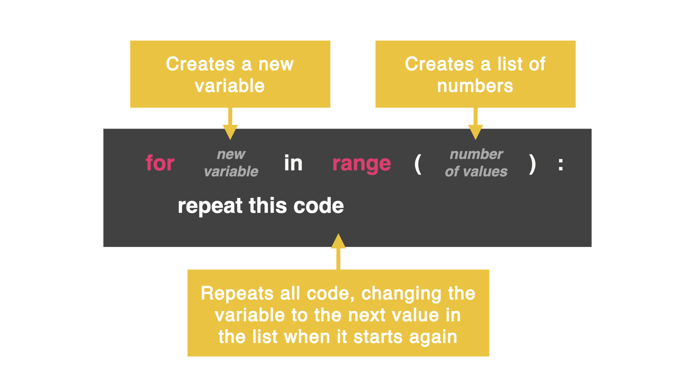

# For Loop

A `while` loop is perfect to use when we *don't* know how many times we want the loop to repeat.

If we have an idea of how many times we want the loop to repeat, we can use a `for` loop to loop code in exactly the same way the `while` loop did. 

However, we can set up the variable, control condition, and increment all in **ONE** line of code.



## Let's compare

Here is how we created a counter with a `while` loop:

```python
counter = 0
while counter < 10:
  print(counter)
  counter += 1
```

And here is the same counter using a `for` loop:

```python
for counter in range(10):
  print(counter)
```


